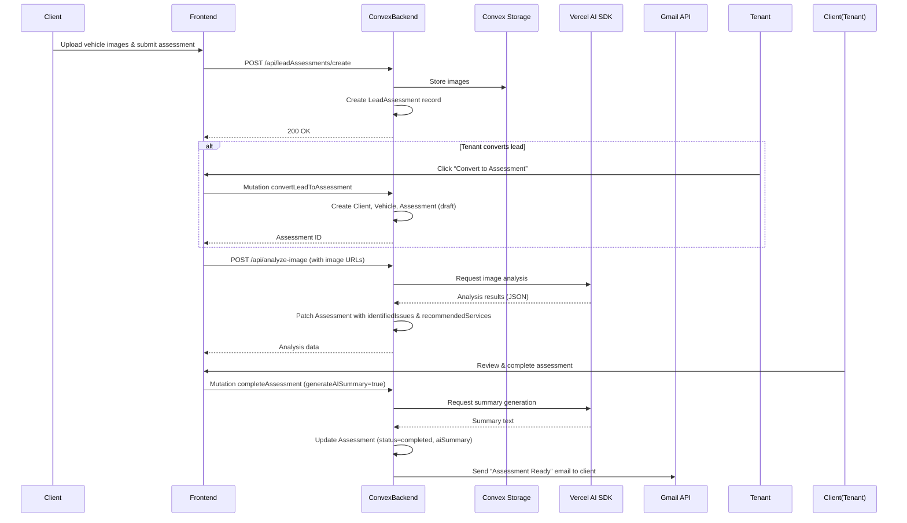
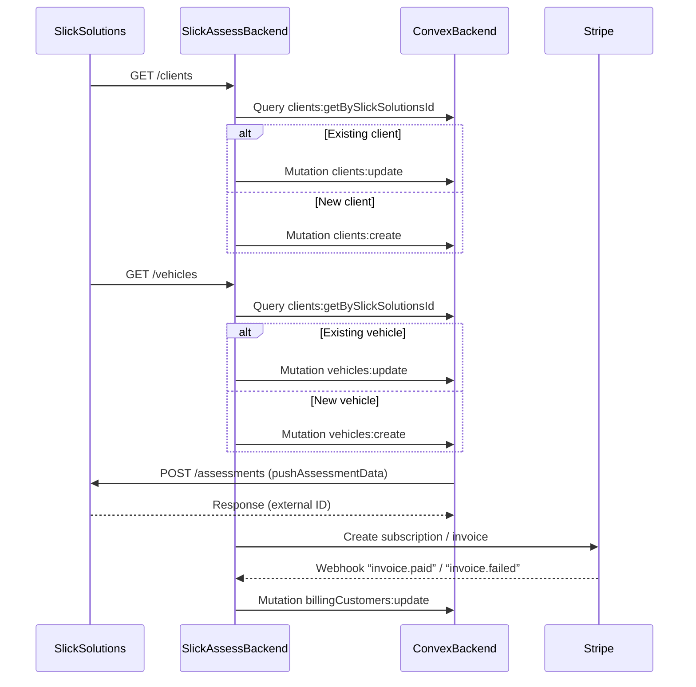
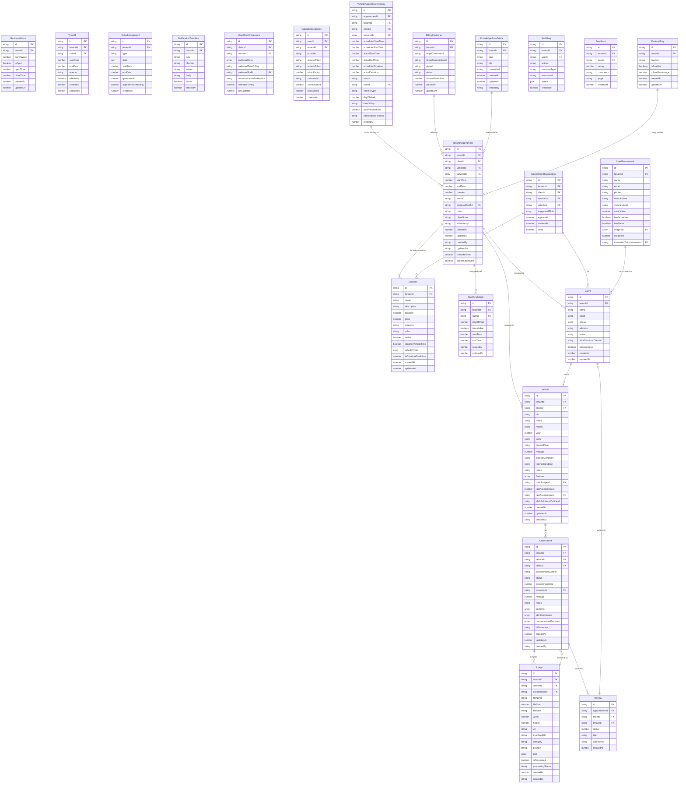

````markdown
# SlickAssess

SlickAssess is a multi‐tenant SaaS platform built for professional auto detailers. It streamlines vehicle assessments, appointment scheduling, and customer engagement through AI‐powered tools and modern integrations. SlickAssess leverages:

- **Next.js (App Router)** for frontend routing and server components  
- **Clerk** for authentication, authorization, and multi‐tenant organization management  
- **Convex** for real‐time database, file storage, and vector search  
- **Vercel AI SDK** for image analysis (GPT‐4 Vision) and text summarization (GPT‐4)  
- **Stripe** for subscription billing and payment processing  
- **Google Calendar & Gmail API** for scheduling and email notifications  
- **Tailwind CSS** (dark‐mode first) for styling and WCAG compliance  

Below is an overview of SlickAssess’s architecture, data model, component outline, and setup instructions. All relevant diagrams are provided as Mermaid code blocks to illustrate relationships, data flows, and system architecture.

---

## Table of Contents

1. [Project Overview](#project-overview)  
2. [Data Model (ERD)](#data-model-erd)  
3. [System Architecture](#system-architecture)  
4. [Data Flows](#data-flows)  
   - [Vehicle Assessment Flow](#vehicle-assessment-flow)  
   - [Data Synchronization Flow](#data-synchronization-flow)  
5. [Component & Feature Outline](#component--feature-outline)  
6. [Folder Structure](#folder-structure)  
7. [Setup & Development](#setup--development)  
   - [Prerequisites](#prerequisites)  
   - [Local Environment](#local-environment)  
   - [Environment Variables](#environment-variables)  
   - [Scripts](#scripts)  
8. [Diagrams & Explanations](#diagrams--explanations)  
   - [Entity Relationship Diagram (ERD)](#entity-relationship-diagram-erd)  
   - [System Architecture Diagram](#system-architecture-diagram)  
   - [Vehicle Assessment Data Flow](#vehicle-assessment-data-flow)  
   - [Data Synchronization Flow](#data-synchronization-flow)  
9. [License & Acknowledgments](#license--acknowledgments)

---

## Project Overview

SlickAssess brings together a set of modern web technologies to solve real‐world challenges faced by auto detailers:

- **AI‐Powered Vehicle Diagnostics**: Upload vehicle photos; Vercel AI SDK (GPT‐4 Vision) analyzes them for damage, identifies issues, and recommends detailing services. AI summarizes key findings into human‐readable text.
- **QR‐Driven Self‐Assessment**: Each tenant receives a unique, static QR code. When scanned, clients access a mobile‐friendly “Self‐Assessment” form—no login required—to submit basic vehicle info, photos, and service requests. Leads flow directly into the tenant’s dashboard for conversion.
- **Appointment Scheduling**: Robust calendar integration with Google Calendar ensures staff availability, prevents double‐booking, and sends SMS/email reminders to reduce no‐shows.
- **Multi‐Tenant Isolation & RBAC**: Clerk manages user authentication, multi‐tenant organizations, and role‐based access control. Each tenant has isolated data (via `orgId`) and customizable branding.
- **Dynamic Pricing & Estimates**: Convex functions calculate costs in real time, factoring in service duration, condition multipliers, seasonal adjustments, and volume discounts. After a self‐assessment or full assessment, the system generates an itemized estimate.
- **File Storage & Vector Search (Convex)**: Images, PDFs, and reports live in Convex Storage. AI summaries and key fields are embedded and indexed via Convex’s vector search to enable semantic lookup of similar past assessments.
- **Stripe Billing & Subscription Management**: Tenants subscribe to tiered plans. Stripe Checkout and Customer Portal handle payments. Webhooks synchronize subscription states into Convex.
- **Analytics & Insights**: Event logging (BigQuery integration) powers dashboards showing appointments, revenue trends, peak hours, cancellation rates, and predictive analytics.
- **Ratings & Reviews**: Clients rate and review completed services. Reviews display on a dedicated widget to foster quality and accountability.
- **Knowledge Base & In‐App Feedback**: Tenants publish Markdown‐based knowledge‐base articles. Clients submit in‐app feedback, feeding back into tenant dashboards.

---

## Data Model (ERD)

Below is the complete Entity Relationship Diagram (ERD) for SlickAssess’s core data model. It represents tables (Convex collections) and their relationships.

```mermaid
erDiagram
    %% Entity boxes
    TenantAppointment {
      string id PK
      string tenantId FK
      string clientId FK
      string vehicleId FK
      array serviceIds FK
      number startTime
      number endTime
      number duration
      string status
      string assignedStaffId FK
      string notes
      string clientNotes
      string aiSummary
      number createdAt
      number updatedAt
      string createdBy
      string updatedBy
      boolean reminderSent
      boolean confirmationSent
    }

    BusinessHours {
      string id PK
      string tenantId FK
      number dayOfWeek
      boolean isOpen
      number openTime
      number closeTime
      number createdAt
      number updatedAt
    }

    Services {
      string id PK
      string tenantId FK
      string name
      string description
      number duration
      number price
      string category
      string color
      boolean active
      boolean requiresVehicleType
      array vehicleTypes
      number aiDurationPrediction
      number createdAt
      number updatedAt
    }

    StaffAvailability {
      string id PK
      string tenantId FK
      string staffId FK
      number dayOfWeek
      boolean isAvailable
      number startTime
      number endTime
      number createdAt
      number updatedAt
    }

    TimeOff {
      string id PK
      string tenantId FK
      string staffId FK
      number startDate
      number endDate
      string reason
      boolean isHoliday
      number createdAt
      number updatedAt
    }

    SchedulingInsight {
      string id PK
      string tenantId FK
      string type
      json data
      number startDate
      number endDate
      number generatedAt
      boolean appliedInScheduling
      number createdAt
    }

    NotificationTemplate {
      string id PK
      string tenantId FK
      string type
      string channel
      string subject
      string body
      boolean active
      number createdAt
    }

    UserClientPreference {
      string id PK
      string clientId FK
      string tenantId FK
      array preferredDays
      string preferredTimeOfDay
      string preferredStaffId FK
      string communicationPreference
      number reminderTiming
      number lastUpdated
    }

    CalendarIntegration {
      string id PK
      string userId FK
      string tenantId FK
      string provider
      string accessToken
      string refreshToken
      number tokenExpiry
      string calendarId
      boolean syncEnabled
      number lastSynced
      number createdAt
    }

    VehicleAppointmentHistory {
      string id PK
      string appointmentId FK
      string tenantId FK
      string clientId FK
      array serviceIds FK
      number scheduledStartTime
      number scheduledEndTime
      number actualStartTime
      number actualEndTime
      number scheduledDuration
      number actualDuration
      string status
      string staffId FK
      string vehicleType
      number dayOfWeek
      string timeOfDay
      boolean wasRescheduled
      string cancellationReason
      number createdAt
    }

    AppointmentSuggestion {
      string id PK
      string tenantId FK
      string clientId FK
      array serviceIds FK
      string vehicleId FK
      array suggestedSlots
      number expiresAt
      number createdAt
      boolean used
    }

    Client {
      string id PK
      string tenantId FK
      string name
      string email
      string phone
      string address
      string notes
      string slickSolutionsClientId
      boolean portalAccess
      number createdAt
      number updatedAt
    }

    Vehicle {
      string id PK
      string tenantId FK
      string clientId FK
      string vin
      string make
      string model
      number year
      string color
      string licensePlate
      number mileage
      string exteriorCondition
      string interiorCondition
      string notes
      array features
      string mainImageId FK
      number lastAssessmentAt
      string lastAssessmentId FK
      string slickSolutionsVehicleId
      number createdAt
      number updatedAt
      string createdBy
    }

    Assessment {
      string id PK
      string tenantId FK
      string vehicleId FK
      string clientId FK
      string assessmentNumber
      string status
      number assessmentDate
      string assessorId FK
      number mileage
      string notes
      array sections
      array identifiedIssues
      array recommendedServices
      string aiSummary
      number createdAt
      number updatedAt
      string createdBy
    }

    Image {
      string id PK
      string tenantId FK
      string vehicleId FK
      string assessmentId FK
      string fileName
      number fileSize
      string fileType
      number width
      number height
      string url
      string thumbnailUrl
      string category
      string position
      array tags
      boolean isProcessed
      string processingStatus
      number createdAt
      string createdBy
    }

    Review {
      string id PK
      string appointmentId FK
      string clientId FK
      string tenantId FK
      number rating
      string title
      string comments
      number createdAt
    }

    BillingCustomer {
      string id PK
      string tenantId FK
      string stripeCustomerId
      string stripeSubscriptionId
      string planId
      string status
      number currentPeriodEnd
      number createdAt
      number updatedAt
    }

    KnowledgeBaseArticle {
      string id PK
      string tenantId FK
      string slug
      string title
      string contentMd
      number createdAt
      number updatedAt
      string createdBy
    }

    AuditLog {
      string id PK
      string tenantId FK
      string userId FK
      string action
      string resourceType
      string resourceId
      json details
      number createdAt
    }

    LeadAssessment {
      string id PK
      string tenantId FK
      string name
      string email
      string phone
      string vehicleMake
      string vehicleModel
      number vehicleYear
      boolean hasScratches
      boolean hasDents
      array imageIds FK
      number createdAt
      string convertedToAssessmentId FK
    }

    Feedback {
      string id PK
      string tenantId FK
      string userId FK
      number rating
      string comments
      string page
      number createdAt
    }

    FeatureFlag {
      string id PK
      string tenantId FK
      string flagKey
      boolean isEnabled
      number rolloutPercentage
      number createdAt
      number updatedAt
    }

    %% Relationships
    TenantAppointment ||--o{ Client : "belongs to"
    TenantAppointment ||--o{ Vehicle : "belongs to"
    TenantAppointment ||--o{ Services : "includes services"
    TenantAppointment ||--o{ StaffAvailability : "assigned staff"
    VehicleAppointmentHistory ||--o{ TenantAppointment : "tracks history of"
    AppointmentSuggestion ||--o{ Client : "for"
    AppointmentSuggestion ||--o{ Services : "suggests services"
    Client ||--o{ Vehicle : "owns"
    Vehicle ||--o{ Assessment : "has"
    Assessment ||--o{ Image : "includes"
    Assessment ||--o{ Review : "receives"
    Image ||--o{ Assessment : "analyzed by"
    Review ||--o{ Client : "written by"
    BillingCustomer ||--o{ TenantAppointment : "billed for"
    KnowledgeBaseArticle ||--o{ TenantAppointment : "referenced in"
    LeadAssessment ||--o{ Client : "may convert to"
    FeatureFlag ||--o{ TenantAppointment : "may enable"
````

---

## System Architecture

The diagram below illustrates SlickAssess’s core system architecture, including frontend, backend, AI, and integration components.

```mermaid
flowchart LR
    subgraph Client Browser
        A1[Next.js App (SSR/CSR)]
    end

    subgraph Vercel Edge Network
        A2[Frontend Static Assets & Edge Caching]
    end

    subgraph Next.js Server
        B1[Next.js App Router]
        B2[API Route Handlers]
    end

    subgraph Convex Backend
        C1[Convex Functions (Queries, Mutations, Actions)]
        C2[Convex Database]
        C3[Convex Storage]
    end

    subgraph AI Services
        D1[Vercel AI SDK (GPT-4 Vision, GPT-4)]
        D2[OpenAI API]
    end

    subgraph Integrations
        E1[Slick Solutions API]
        E2[Stripe API]
        E3[Google Calendar API]
        E4[Google Gmail API]
        E5[Google Chat Webhooks]
    end

    subgraph Analytics
        F1[BigQuery]
    end

    subgraph Authentication
        G1[Clerk Auth]
        G2[Clerk UI Components]
    end

    A1 --> A2
    A2 --> B1
    A1 -->|API Calls| B2
    B1 --> C1
    B2 --> C1
    C1 --> C2
    C1 --> C3
    C1 -->|AI Calls| D1
    D1 --> D2
    C1 -->|Sync| E1
    C1 -->|Payments| E2
    C1 -->|Calendar| E3
    C1 -->|Email| E4
    C1 -->|Chat| E5
    C1 --> F1
    B1 --> G1
    A1 --> G2
```

---

## Data Flows

### Vehicle Assessment Flow

This sequence diagram shows how a client’s assessment flows from image upload through AI analysis, assessment completion, and result delivery.



---

### Data Synchronization Flow

This flow depicts how SlickAssess synchronizes data with the Slick Solutions platform and billing systems (SlickPay).



---

## Component & Feature Outline

Below is a high‐level outline of all major React components and sub-components necessary to build SlickAssess. Components are organized by domain and presented in the logical order of implementation.

### Phase 1 – Foundation & Layout Components

1. **Theme & Global Styles**

   * `ThemeProvider` (dark/light mode context)
   * `GlobalStyles` (Tailwind imports, CSS variables for tenant colors)

2. **Authentication Wrappers (Clerk)**

   * `AuthProvider` (wraps `<ClerkProvider>`)
   * `RequireAuth` (HOC/hook to guard protected pages)
   * `RequireRole` (HOC/hook to enforce role‐based access)

3. **Global Layout & Navigation**

   * `AppLayout` (renders `<Navbar>`, `<Sidebar>`, `<Footer>`)
   * `Navbar` (logo, nav links, `<UserMenu>`)
   * `Sidebar` (tenant navigation, collapsible)
   * `Footer` (static footer)
   * Sub‐components: `NavLink`, `MobileMenuButton`, `MobileDropdown`

4. **Error & Loading Boundaries**

   * `ErrorBoundary` (catches React errors)
   * `LoadingSpinner` (SVG or Tailwind spinner)

### Phase 2 – Shared UI Primitives & Form Controls

1. **Form Controls**

   * `TextInput` (with label, error message)
   * `NumberInput` (enforces numeric input)
   * `TextArea` (multi‐line input with label)
   * `Select` (single‐select dropdown)
   * `MultiSelect` (checkbox‐style multi‐select)
   * `Checkbox` (single checkbox)
   * `RadioGroup` & `RadioOption`
   * `DatePicker` (uses `react-datepicker`)
   * `DateTimePicker` (date + time)
   * `FileUploader` (drag‐and‐drop + standard file input)

2. **Buttons**

   * `Button` (primary, secondary, outline, danger variants)
   * `SubmitButton` (disables and shows spinner when submitting)
   * `IconButton` (icon‐only button)
   * `LinkButton` (styled link as button)

3. **Modals & Dialogs**

   * `Modal` (fullscreen overlay with header, content, footer)
   * `ConfirmDialog` (“Are you sure?” confirmation)

4. **Tables & Lists**

   * `Table` (generic table with columns, rows)
   * `PaginatedTable` (table + pagination controls)
   * `List` (vertical list rendering function)
   * `PaginatedList` (list + pagination)

5. **Cards & Widgets**

   * `KpiCard` (key metric + mini chart)
   * `InsightCard` (analytics widget container)
   * `StatCard` (single statistic with icon)

6. **Charts (Recharts)**

   * `LineChartWrapper` (`LineChart` via Recharts)
   * `BarChartWrapper` (`BarChart` via Recharts)
   * `GaugeChart` (single‐value gauge)

7. **Image & File Display**

   * `ImageThumbnail` (small clickable thumbnail)
   * `ImageLightbox` (modal for browsing images)
   * `FileLink` (download link with icon + size)

8. **Notifications & Toasts**

   * `ToastProvider` + `useToast` hook (global toast context)
   * `Toast` (individual toast message)

### Phase 3 – Tenant & Branding Components

1. **`TenantContextProvider`**

   * Fetches tenant record by `orgId`; exposes `tenant` (colors, logo, qrSlug, qrCodeUrl).

2. **`TenantBrandingForm`**

   * Fields: Logo upload, primary color, secondary color, custom CSS.
   * Saves via `updateTenantBranding` mutation; updates `TenantContext`.

3. **`QRCodeDisplay`**

   * Renders `` with `tenant.qrCodeUrl`, “Download” button.

4. **`ThemeToggle`**

   * Switch between light/dark mode; persists to `localStorage`.

5. **`OrganizationSwitcher`** (Clerk‐provided)

   * Allows users in multiple organizations to switch context.

### Phase 4 – Shared Utility Components & Hooks

1. **Data Fetching & Mutation Hooks (Convex)**

   * `useGetClients`, `useCreateClient`
   * `useGetVehicles`, `useCreateVehicle`, `useUpdateVehicle`
   * Similar hooks for `services`, `assessments`, `appointments`, `leadAssessments`, etc.

2. **Form State & Validation Helpers**

   * `useFormState(initialValues, validateFn, onSubmit)`
   * Validators: `validateEmail`, `validateRequired`, `validatePhone`, `validateVIN`

3. **Price Calculation Utilities**

   * `calculateServicePrice(service, condition, date, quantity)`
   * `formatCurrency(amount)`

4. **Date & Time Utilities**

   * `formatDate(timestamp, format)` (using `date-fns` or `dayjs`)
   * `formatTime(timestamp)`
   * `getTimeSlots(businessHours, slotDuration)`

5. **AI Integration Helpers**

   * `analyzeVehicleImage(imageUrl, options)` → calls Vercel AI (GPT‐4 Vision)
   * `generateAssessmentSummary(data, options)` → calls Vercel AI (GPT‐4)
   * `computeEmbedding(text)` → calls OpenAI embeddings

6. **Vector Search Utilities**

   * `useVectorSearchAssessments(queryText)` → returns similar assessments

7. **Notification & Email Helpers**

   * `sendEmail(template, to, variables)` → uses Gmail API
   * `sendSMS(template, to, variables)` (if Twilio or equivalent)
   * `useToast()` → to show success/error toasts

8. **Calendar Integration Helpers**

   * `getGoogleOAuthUrl(redirectUri)` → constructs OAuth URL
   * `exchangeGoogleCodeForTokens(code)` → exchanges code for tokens
   * `syncGoogleCalendarEvents(integration, orgId)` → fetches events & upserts appointments

9. **Stripe Integration Helpers**

   * `createCheckoutSession(orgId, priceId)` → returns `sessionId`
   * `createCustomerPortalSession(customerId)` → returns portal URL
   * `handleStripeWebhook(event)` → updates billing tables

---

## Folder Structure

A clear folder organization keeps the codebase maintainable. Below is the recommended `src/` layout:

```
src/
├── app/
│   ├── layout.tsx
│   ├── middleware.ts
│   ├── page.tsx
│   ├── (auth)/ 
│   │   ├── sign-in/page.tsx
│   │   └── sign-up/page.tsx
│   ├── scan/
│   │   └── [qrSlug]/
│   │       ├── page.tsx
│   │       ├── SelfAssessmentForm.tsx
│   │       └── estimate/
│   │           └── [estimateId]/page.tsx
│   ├── api/
│   │   ├── leadAssessments/create/route.ts
│   │   ├── estimates/[estimateId]/route.ts
│   │   ├── calendar/
│   │   │   ├── connect/route.ts
│   │   │   ├── callback/route.ts
│   │   │   └── sync/route.ts
│   │   ├── billing/
│   │   │   ├── create-checkout-session/route.ts
│   │   │   ├── create-portal-session/route.ts
│   │   │   └── webhooks/stripe.ts
│   │   └── notifications/jobs/send-reminders/route.ts
│   ├── settings/
│   │   ├── branding/page.tsx
│   │   ├── integrations/page.tsx
│   │   ├── notification-templates/page.tsx
│   │   ├── billing/page.tsx
│   │   └── knowledge-base/
│   │       ├── page.tsx
│   │       ├── new/page.tsx
│   │       └── [articleId]/edit/page.tsx
│   ├── dashboard/
│   │   ├── layout.tsx
│   │   ├── page.tsx
│   │   ├── clients/page.tsx
│   │   ├── vehicles/page.tsx
│   │   ├── assessments/page.tsx
│   │   ├── appointments/page.tsx
│   │   ├── leads/page.tsx
│   │   ├── services/page.tsx
│   │   ├── calendar/page.tsx
│   │   ├── insights/page.tsx
│   │   └── reviews/page.tsx
│   ├── clients/
│   │   ├── page.tsx
│   │   ├── new/page.tsx
│   │   └── [clientId]/
│   │       ├── edit/page.tsx
│   │       └── view/page.tsx
│   ├── vehicles/
│   │   ├── new/page.tsx
│   │   └── [vehicleId]/
│   │       ├── edit/page.tsx
│   │       └── view/page.tsx
│   ├── assessments/
│   │   ├── new/page.tsx
│   │   └── [assessmentId]/
│   │       ├── edit/page.tsx
│   │       └── view/page.tsx
│   ├── appointments/
│   │   ├── new/page.tsx
│   │   └── [appointmentId]/
│   │       ├── edit/page.tsx
│   │       └── view/page.tsx
│   ├── leads/
│   │   └── [leadId]/view/page.tsx
│   ├── services/
│   │   ├── new/page.tsx
│   │   └── [serviceId]/edit/page.tsx
│   ├── reviews/
│   │   └── [appointmentId]/review/page.tsx
│   └── help/
│       └── [...slug]/page.tsx
│
├── components/
│   ├── primitives/
│   │   ├── Button.tsx
│   │   ├── TextInput.tsx
│   │   ├── Select.tsx
│   │   ├── Modal.tsx
│   │   ├── Table.tsx
│   │   ├── LoadingSpinner.tsx
│   │   └── …others
│   │
│   ├── layout/
│   │   ├── AppLayout.tsx
│   │   ├── Navbar.tsx
│   │   ├── Sidebar.tsx
│   │   ├── Footer.tsx
│   │   ├── ErrorBoundary.tsx
│   │   └── LoadingOverlay.tsx
│   │
│   ├── brand/
│   │   ├── TenantContextProvider.tsx
│   │   ├── TenantBrandingForm.tsx
│   │   ├── QRCodeDisplay.tsx
│   │   └── ThemeToggle.tsx
│   │
│   ├── clients/
│   │   ├── ClientForm.tsx
│   │   ├── ClientTable.tsx
│   │   ├── ClientDetailCard.tsx
│   │   └── ClientPreferencesForm.tsx
│   │
│   ├── vehicles/
│   │   ├── VehicleForm.tsx
│   │   ├── VehicleTable.tsx
│   │   ├── VehicleDetailCard.tsx
│   │   └── VehicleImageGallery.tsx
│   │
│   ├── services/
│   │   ├── ServiceForm.tsx
│   │   ├── ServiceTable.tsx
│   │   └── PriceEstimateCard.tsx
│   │
│   ├── leads/
│   │   ├── SelfAssessmentForm.tsx
│   │   ├── LeadListItem.tsx
│   │   └── LeadDetailCard.tsx
│   │
│   ├── assessments/
│   │   ├── AssessmentForm.tsx
│   │   ├── AssessmentDetailCard.tsx
│   │   ├── IssuesList.tsx
│   │   ├── SuggestedIssuesList.tsx
│   │   └── ShareAssessmentDialog.tsx
│   │
│   ├── appointments/
│   │   ├── AppointmentForm.tsx
│   │   ├── AppointmentCalendar.tsx
│   │   ├── AppointmentListItem.tsx
│   │   └── AppointmentReminderScheduler.tsx
│   │
│   ├── availability/
│   │   ├── BusinessHoursForm.tsx
│   │   ├── StaffAvailabilityForm.tsx
│   │   └── TimeOffForm.tsx
│   │
│   ├── notifications/
│   │   ├── NotificationTemplateForm.tsx
│   │   ├── NotificationTemplateList.tsx
│   │   └── ClientPreferencesForm.tsx
│   │
│   ├── integrations/
│   │   ├── CalendarIntegrationStatus.tsx
│   │   ├── GoogleOAuthButton.tsx
│   │   └── GoogleChatWebhookForm.tsx
│   │
│   ├── billing/
│   │   ├── SubscriptionStatusCard.tsx
│   │   ├── PricingPlanCard.tsx
│   │   └── (Stripe webhook handler in `src/lib/stripeUtils.ts`)
│   │
│   ├── reviews/
│   │   ├── ReviewForm.tsx
│   │   ├── ReviewTable.tsx
│   │   └── RatingInput.tsx
│   │
│   ├── analytics/
│   │   ├── AppointmentsPerDayChart.tsx
│   │   ├── RevenuePerMonthChart.tsx
│   │   ├── PeakHoursChart.tsx
│   │   └── CancellationRateGauge.tsx
│   │
│   ├── advanced/
│   │   ├── ImageAnalysisButton.tsx
│   │   ├── VectorSearchInput.tsx
│   │   └── SemanticAssessmentList.tsx
│   │
│   ├── knowledgeBase/
│   │   ├── ArticleForm.tsx
│   │   ├── ArticleListItem.tsx
│   │   └── ArticleDisplay.tsx
│   │
│   └── utilities/
│       ├── Breadcrumbs.tsx
│       ├── ToastProvider.tsx
│       ├── Toast.tsx
│       ├── ScrollToTopButton.tsx
│       ├── PermissionDenied.tsx
│       └── NotFound.tsx
│
├── hooks/
│   ├── useGetClients.ts
│   ├── useCreateClient.ts
│   ├── useGetVehicles.ts
│   ├── useCreateVehicle.ts
│   ├── … (one file per query/mutation)
│   └── useFormState.ts
│
├── utils/
│   ├── dateUtils.ts
│   ├── priceUtils.ts
│   ├── aiUtils.ts
│   ├── vectorSearchUtils.ts
│   ├── notificationUtils.ts
│   ├── calendarUtils.ts
│   └── stripeUtils.ts
│
├── lib/
│   ├── ai/
│   │   ├── imageAnalysis.ts
│   │   └── summaryGeneration.ts
│   ├── integrations/
│   │   ├── slickSolutions.ts
│   │   ├── googleCalendar.ts
│   │   └── googleChat.ts
│   └── convex/
│       └── convexClient.ts
│
└── styles/
    ├── tailwind.css
    └── globals.css
```

---

## Setup & Development

### Prerequisites

1. **Node.js** v18 or higher
2. **npm** or **yarn** package manager
3. **Git** for version control
4. **Convex CLI** (`npm install --global convex`)
5. **Stripe CLI** (for local webhook testing)
6. **Google Cloud Project** for Calendar & Gmail OAuth
7. **Clerk Account** for authentication / organization management

---

### Local Environment

1. **Clone & Initialize**

   ```bash
   git clone https://github.com/your-username/slickassess.git
   cd slickassess
   ```

2. **Install Dependencies**

   ```bash
   npm install
   # or
   yarn install
   ```

3. **Initialize Convex**
   If you haven’t already created a Convex project, do so in a separate folder:

   ```bash
   mkdir slickassess-convex
   cd slickassess-convex
   npx convex init
   # Copy the resulting `convex/` folder into `src/convex/` of your Next.js repo
   ```

   Then deploy your schema to Convex:

   ```bash
   cd slickassess
   npx convex deploy
   ```

4. **Tailwind CSS Setup**
   Tailwind was initialized with `npx tailwindcss init -p`. Ensure your `tailwind.config.js` has:

   ```js
   module.exports = {
     darkMode: "class",
     content: [
       "./src/app/**/*.{js,ts,jsx,tsx}",
       "./src/components/**/*.{js,ts,jsx,tsx}"
     ],
     theme: {
       extend: {
         colors: {
           primary: "#00AE98",
           secondary: "#707070"
         }
       }
     },
     plugins: []
   };
   ```

   In `styles/globals.css`, include:

   ```css
   @tailwind base;
   @tailwind components;
   @tailwind utilities;
   ```

5. **Clerk Configuration**
   Install Clerk SDK:

   ```bash
   npm install @clerk/nextjs
   ```

   In `app/layout.tsx`, wrap with `<ClerkProvider>`:

   ```tsx
   // app/layout.tsx
   "use client";

   import { ClerkProvider } from "@clerk/nextjs";
   import "../styles/globals.css";

   export default function RootLayout({ children }) {
     return (
       <html lang="en" className="dark">
         <head />
         <body>
           <ClerkProvider publishableKey={process.env.NEXT_PUBLIC_CLERK_PUBLISHABLE_KEY}>
             {children}
           </ClerkProvider>
         </body>
       </html>
     );
   }
   ```

6. **Environment Variables**
   Create a `.env.local` file in the project root with:

   ```
   NEXT_PUBLIC_CLERK_PUBLISHABLE_KEY=your-clerk-publishable-key
   CLERK_API_KEY=your-clerk-secret-key
   NEXT_PUBLIC_CONVEX_URL=your-convex-url
   CONVEX_ADMIN_KEY=your-convex-admin-key
   STRIPE_SECRET_KEY=your-stripe-secret-key
   STRIPE_WEBHOOK_SECRET=your-stripe-webhook-secret
   GOOGLE_CLIENT_ID=your-google-client-id
   GOOGLE_CLIENT_SECRET=your-google-client-secret
   ```

   Adjust as needed for your local and production environments.

7. **Run in Development Mode**
   Start Convex locally and the Next.js dev server concurrently:

   ```bash
   # In one terminal:
   npx convex dev
   # In another terminal:
   npm run dev
   ```

   The Next.js app will be available at [http://localhost:3000](http://localhost:3000), and Convex functions at [http://localhost:3333](http://localhost:3333) by default.

---

### Scripts

Add these scripts to your `package.json` under `"scripts"`:

```json
{
  "scripts": {
    "dev": "next dev",
    "build": "next build",
    "start": "next start",
    "lint": "eslint . --ext .ts,.tsx",
    "type-check": "tsc --noEmit",
    "convex:dev": "convex dev",
    "convex:push": "convex deploy",
    "test": "jest --passWithNoTests",
    "e2e": "playwright test"
  }
}
```

* `npm run dev`: Starts Next.js development server at port 3000.
* `npm run convex:dev`: Starts Convex local development server.
* `npm run build`: Builds Next.js for production.
* `npm run start`: Runs the production build locally.
* `npm run lint`: Runs ESLint.
* `npm run type-check`: Runs TypeScript type checking.
* `npm run convex:push`: Deploys Convex schema & functions.
* `npm run test`: Runs unit & integration tests via Jest.
* `npm run e2e`: Runs end‐to‐end tests via Playwright.

---

## Diagrams & Explanations

Below are all relevant diagrams (as Mermaid code blocks). Render them in any Markdown viewer that supports Mermaid (e.g., GitHub, VS Code with appropriate extension).

### Entity Relationship Diagram (ERD)



---

## System Architecture Diagram

```mermaid
flowchart LR
    subgraph Client Browser
        A1[Next.js App (SSR/CSR)]
    end

    subgraph Vercel Edge Network
        A2[Frontend Static Assets & Edge Caching]
    end

    subgraph Next.js Server
        B1[Next.js App Router]
        B2[API Route Handlers]
    end

    subgraph Convex Backend
        C1[Convex Functions (Queries, Mutations, Actions)]
        C2[Convex Database]
        C3[Convex Storage]
    end

    subgraph AI Services
        D1[Vercel AI SDK (GPT-4 Vision, GPT-4)]
        D2[OpenAI API]
    end

    subgraph Integrations
        E1[Slick Solutions API]
        E2[Stripe API]
        E3[Google Calendar API]
        E4[Google Gmail API]
        E5[Google Chat Webhooks]
    end

    subgraph Analytics
        F1[BigQuery]
    end

    subgraph Authentication
        G1[Clerk Auth]
        G2[Clerk UI Components]
    end

    A1 --> A2
    A2 --> B1
    A1 -->|API Calls| B2
    B1 --> C1
    B2 --> C1
    C1 --> C2
    C1 --> C3
    C1 -->|AI Calls| D1
    D1 --> D2
    C1 -->|Sync| E1
    C1 -->|Payments| E2
    C1 -->|Calendar| E3
    C1 -->|Email| E4
    C1 -->|Chat| E5
    C1 --> F1
    B1 --> G1
    A1 --> G2
```

---

## Vehicle Assessment Data Flow


---

## Data Synchronization Flow


---

## License & Acknowledgments

* **License**: [MIT License](LICENSE)
* **Acknowledgments**:

  * Next.js (App Router) documentation
  * Clerk documentation
  * Convex documentation
  * Vercel AI SDK guides
  * Stripe Next.js integration guides
  * Tailwind CSS documentation

---

**Thank you for using SlickAssess!** Feel free to reach out via our support channels or refer to the in-app knowledge base for more information.
